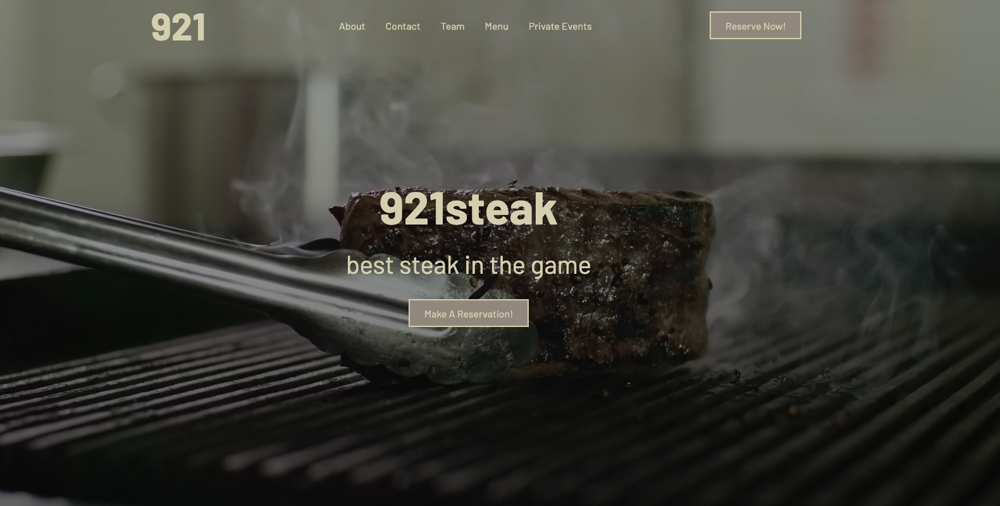
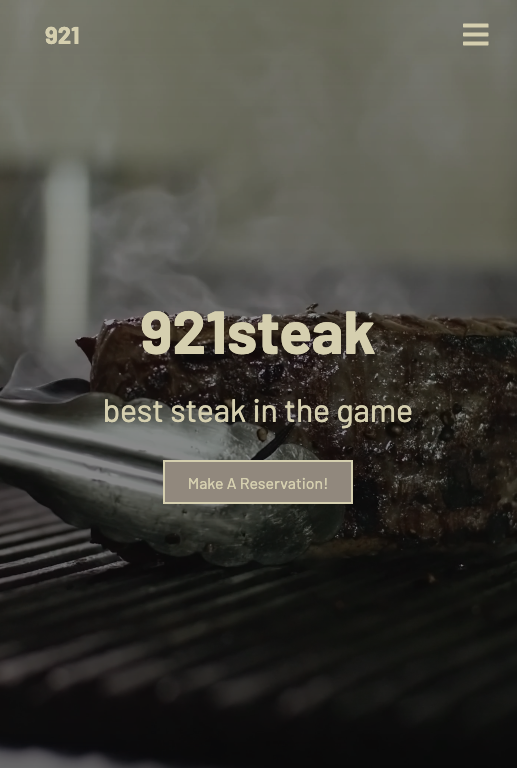
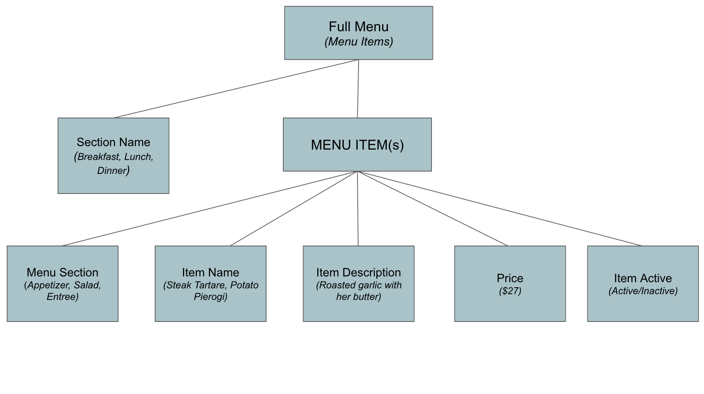

## 921Steak

## Maintained

## Motivation:
The "Industry", which is comprised primarily of bars and restaurants, often outsource the building of their websites to third party services. With this comes the less than stellar access to update their seasonally changing menu or 86 items for which they no longer have stock to make. Giving control back to restaurant operators was the central motivation of ths project. Using a fake restaurant website, 921Steak, we wanted to create a fullstack application where an operation can login to their website and create, update, and delete menu items as needed. 
## Screenshots

## Tech/Framework Used
1. Frontend: 
    - React
2. Backend: 
    - Django
    - Python 3  
## Features
- Opentable widget integration 
- Google maps integration (Still in progress)
## Tests (Updates coming)
## Installation 
### Python must be version 3 or greater for installation
1. Fork and clone this repository 
2. Navigate into project-4-be
3. Install pipenv
`brew pipenv shell`
4. Install Django
`pipenv install django`
5. Install PostgreSQL to connect to Django
`pipenv install psycopg2-binary`
6. Check to be sure Postgres is running on your computer
- For macOS:
`brew services list`
- For Linux:
`service postgresql status`
7. Create the database:
`psql -U postgres -f settings.sql`
8. Migrate the restaurant models to the database
`python3 manage.py makemigrations`
`python3 manage.py migrate`
9. Create a superuser in the root directory:
`python3 manage.py createsuperuser`
10. Navigate to localhost:8000/admin to login and populate the database
## Login Credentials
- email: admin@admin.admin
- password: password12
## Entity-Relationship Diagram 

## Credits
- Jake Addis
- Sam Goldstein
- James Tomassoni
